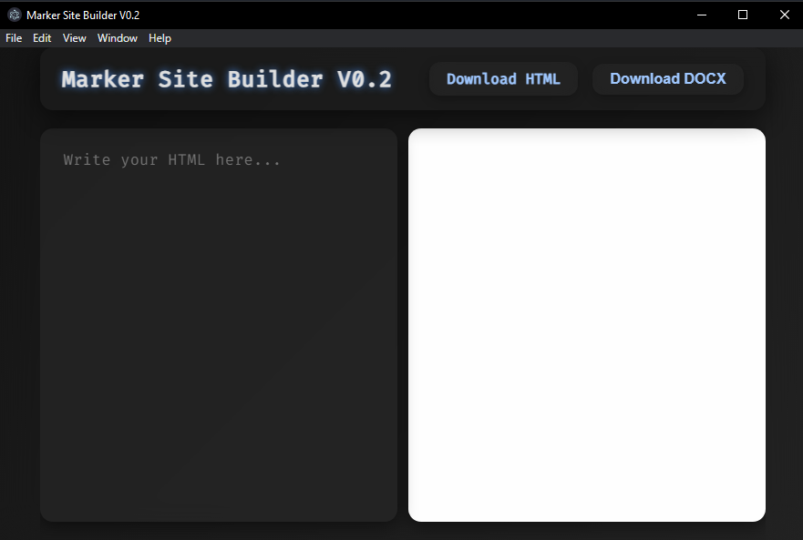

<!-- markdownlint-configure-file {
  "MD013": {
    "code_blocks": false,
    "tables": false
  },
  "MD033": false,
  "MD041": false
} -->

# ✨🚀 Marker IDE — The Next-Gen Code Playground


---

> **Formerly Marker Site Editor**

## 🚦 Quick Notes

- 🛡️ 100% virus-free — scan it yourself!
- 🖥️ Windows executables may trigger browser warnings (not commonly installed). Please report them as **SAFE**.
- 💡 Open for forks, contributions, and promotion!
- ⏳ Development takes time — thanks for your patience.(62 commits,you can see,development is hell XD)
- ⚠️ Built on Windows — **no macOS support (yet)**.

---

## 🌈 **Why Marker?**

- ⚡ **Live Preview/Shell** — see your code in action instantly!
- 🪟 **Glassmorphic macOS-inspired UI** — modern, elegant, and silky-smooth.
- 🌍 **30+ Languages Supported** — code your way.
- 📦 **Multi-format Export** — take your work anywhere.
- 🎨 **VS Code-inspired Experience** — familiar, powerful, and beautiful.

---

## 🛠️ **Installation Guide**

Marker Site Builder is available for **Windows** and **Linux** (Electron-powered for a native feel).

### 🪟 Windows (Portable)

1. Download `MarkerEditor_V{version}_PORTABLE.exe` from [Releases].
2. Run the `.exe` — **no install needed**!

**Update:** Replace the old `.exe` with the new one.

---

### 🪟 Windows (NSIS Installer)

1. Download `MarkerEditor_V{version}_NSIS.exe`.
2. Run the installer.
3. Launch Marker from your Start Menu.

**Update:** Run the new installer — it will overwrite the old version.

---

### 🐧 Linux (.deb for Ubuntu/Debian)

1. Download `MarkerEditor_V{version}.deb`.
2. In terminal:
   ```sh
   sudo dpkg -i MarkerEditor_Linux_V{version}_Deb.deb
   sudo apt-get install -f   # If needed
   ```

---

### 🐧 Linux (AppImage)

1. Download `MarkerEditor_V{version}.AppImage`.
2. In terminal:
   ```sh
   chmod +x MarkerEditor_Linux_V{version}_AppImage.AppImage
   ./MarkerEditor_V{version}.AppImage
   ```
   *(Optional: Integrate with AppImageLauncher)*

---

## 📸 **Sneak Peek**



---

## ❤️ Made with Passion

Crafted by [@robert19066](https://github.com/robert19066)  
✍️ Write with _style_ — write with _**Marker**_!

---

## 💬 Need Help?

Join the discussion or file issues on GitHub.  
Your feedback makes Marker **awesome**!

